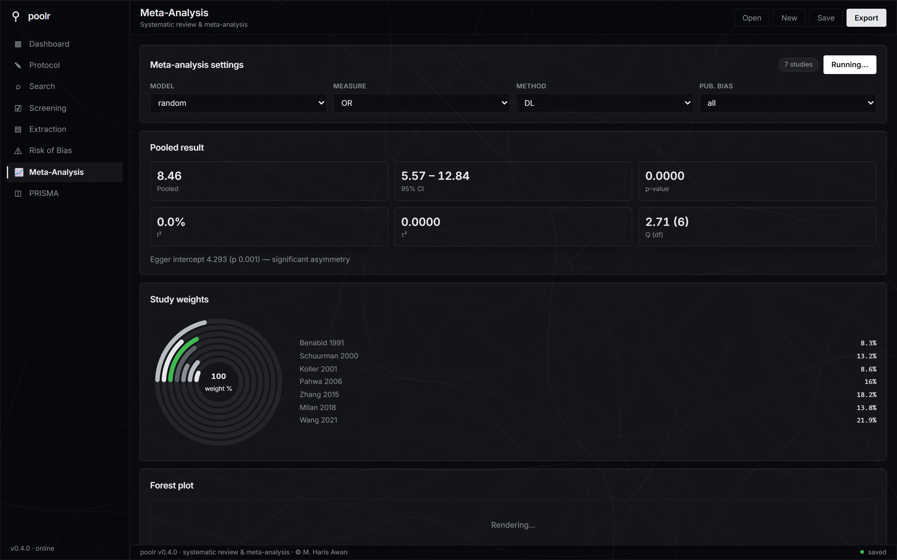
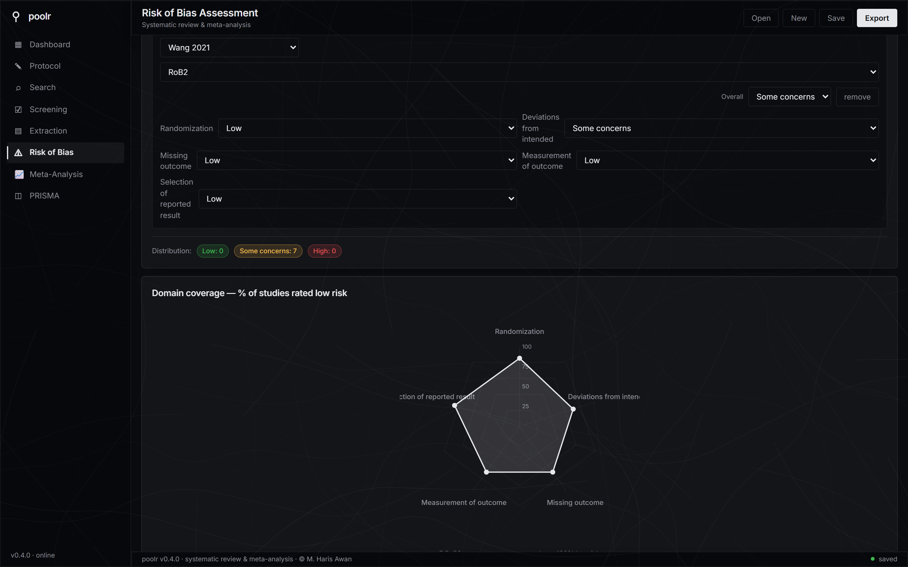
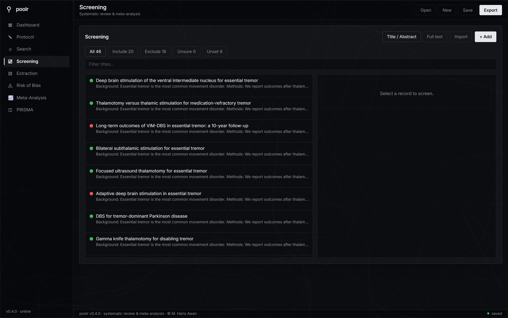

# poolr

[](https://github.com/harisawan-bit/poolr/actions/workflows/ci.yml)
[](https://github.com/harisawan-bit/poolr/actions/workflows/build.yml)
[](https://github.com/harisawan-bit/poolr/releases)
[](https://opensource.org/licenses/MIT)
[](https://dotnet.microsoft.com/)
[](https://github.com/harisawan-bit/poolr/releases)

**poolr** is a free, open-source, no-code desktop application for conducting **Systematic Reviews and Meta-Analyses (SRMA)**. It guides you through the entire PRISMA 2020-compliant pipeline — from PICO definition to publication-ready manuscript — with a modern, native GUI.

No programming required. No cloud dependency. Your data stays on your machine.

> **Current release — v0.5.3.** New interface with light & dark themes, floating-dock navigation, command palette (Ctrl+K), boot splash with first-run personalization, live computation states, screening funnel, reviewer-team selector and a live PRISMA flow diagram. Complete classical meta-analysis (introduced in v0.5.1): Knapp–Hartung CIs, Mantel-Haenszel & Peto poolers (validated against `metafor`'s published outputs), leave-one-out/cumulative sensitivity, computed trim-and-fill, PET/PEESE/p-curve/selection models, proportions/rates/correlations/generic-IV outcome types, robvis-style risk-of-bias figures with ROBINS-I/QUADAS-2/AMSTAR-2, a GRADE Summary-of-Findings generator with OIS imprecision, R replication-script export, BibTeX/RIS citations, structured exclusion reasons with import de-duplication, a PRISMA 27-item checklist tracker, and a one-click demo project. v0.5.2 polishes the desktop build: no console-window flash on Windows launch, truthful app-version and connection indicators, and visible demo-load errors. The app is a fully native desktop build (Tauri 2 / Rust shell, React + TypeScript UI, bundled C# 12 / .NET 8 engine sidecar) — **100% Python-free**. All 8 pages reimplemented, screening import from PubMed/CSV/RIS/EndNote, in-app forest/funnel plots, GRADE, and 6-OS native installers. See [RELEASES.md](./RELEASES.md) for details.

---

## Screenshots

| Dashboard — screening rings & heterogeneity gauge | Meta-analysis — pooled estimate, study weights, forest plot |
|---|---|
|  |  |

| Risk of bias — domain radar | Screening — dual-reviewer decisions |
|---|---|
|  |  |

*Charts are rendered with [Bklit UI](https://bklit.com) components (visx + motion), themed to poolr's monochrome palette.*

---

## Features

### **Protocol & Planning**
- **PICO Builder** for Population, Intervention, Comparator, Outcomes with placeholders
- Protocol registration fields (PROSPERO ID, study designs, date range, languages)
- Auto-saves to local `poolr.json` — fully portable projects

### **Search Strategy Builder**
- Auto-generates search strings for **PubMed/MEDLINE, Embase, Cochrane CENTRAL, Scopus, Web of Science** from your PICO
- Editable syntax-highlighted text areas per database
- Export all strategies as `.txt` for protocol appendix

### **Dual Independent Screening**
- **Title/Abstract** and **Full-Text** screening modes
- Two-reviewer workflow with **conflict detection and resolution UI**
- CSV import/export for Rayyan/Covidence interoperability
- PRISMA flow numbers auto-calculated from decisions

### **Structured Data Extraction**
- Comprehensive forms: Study ID, Design, Population, Intervention/Control groups (binary, continuous, time-to-event), Outcomes, Neurosurgery-specific fields
- CSV and **RIS (EndNote/Zotero/Mendeley)** import/export
- Add/edit/delete studies with validation

### **Risk of Bias Assessment**
- **RoB 2** (RCTs), **NOS** (cohort/case-control), **PROBAST** (diagnostic/prognostic), **ROBINS-I** (non-randomized), **QUADAS-2** (diagnostic accuracy), **AMSTAR-2** (reviews); robvis-style traffic-light + weighted summary-bar figures
- Domain-level judgments with overall rating
- Summary tables auto-generated + **domain-coverage radar chart**

### **Advanced Meta-Analysis Engine**
| Outcome Type | Effect Measures | Models | Methods |
|--------------|----------------|--------|---------|
| Binary | OR, RR, RD | Fixed / Random-effects | DerSimonian-Laird, REML, Paule-Mandel, Hunter-Schmidt |
| Continuous | MD, SMD (Hedges' g) | Fixed / Random-effects | Inverse variance, DL, REML |
| Time-to-event | HR | Fixed / Random-effects | Generic inverse variance |
| Proportions | logit, arcsine, double-arcsine | GLMM, IV | DL, REML |
| Rates | IRR, IRD | Fixed / Random-effects | Inverse variance |
| Correlations | Fisher z | Fixed / Random-effects | Inverse variance |
| Generic IV | user-supplied yi/vi | Fixed / Random-effects | Any |

- **Network Meta-Analysis**: frequentist WLS (Rücker 2012) + Bayesian MCMC, league matrix, P-score/SUCRA ranking, node-split inconsistency
- **Multilevel / Multivariate / RVE**: three-level MA (Cheung 2014), Gleser-Olkin multivariate, cluster-robust RVE with Satterthwaite df
- **Diagnostic Test Accuracy**: bivariate Reitsma (2005) + HSROC, pooled sens/spec, DOR, AUC
- **IPD Meta-Analysis**: two-stage + one-stage Cox frailty, PH test
- **Dose-Response**: linear, E_max parametric, cubic spline (Greenland-Dennek)
- **Prediction intervals** (t-dist, k-2 df), **model averaging** across 6 estimators (Akaike weights)
- **Subgroup analysis** by design, country, year, or custom fields
- **Meta-regression** (year, sample size, continuous covariates)
- **Publication bias**: Egger's test, Begg's test, funnel plot asymmetry
- **Heterogeneity**: Cochran's Q, I² (with 95% CI), τ², H², prediction intervals
- **Sensitivity**: leave-one-out with influence ranking, cumulative meta-analysis, fixed-vs-random comparison
- **Publication-bias depth**: Egger's test, Begg's test, computed trim-and-fill, Peters & Harbord, PET/PEESE, p-curve, Henmi-Copas limit meta-analysis, step-function selection model (3PSM), fail-safe N
- **More outcome types**: single-arm proportions (logit/arcsine), incidence rates (IRR/IRD), correlations (Fisher z), generic inverse-variance; Glass's delta; OR↔RR↔RD↔NNT and SMD↔OR conversions; Wan-2014 median→mean/SD completion
- **Subgroups done right**: model-consistent per-group pooling, within-group heterogeneity, and the Q-between interaction test
- **Study-weight ring chart** — see each study's contribution at a glance

### **Publication-Ready Figures**
- **Forest plots**: weight-proportional squares, diamond pooled estimate, log/linear scale, SVG/PNG/PDF export
- **Funnel plots**: pseudo-95% CI contours, study weights as bubble size, color-coded
- **PRISMA 2020 Flow Diagram**: interactive canvas with auto-population from screening data, SVG export

### **GRADE Evidence Profiles**
- Auto-populated from meta-analysis results + RoB assessments
- Five-domain assessment (Risk of Bias, Inconsistency, Indirectness, Imprecision, Publication Bias)
- Starting certainty (RCT=High, Observational=Low) with automatic downgrade logic
- Export as Word table, LaTeX, JSON

### **Manuscript Export**
- **Word (.docx)**: full PRISMA-structured manuscript with tables, figures, references
- **LaTeX (.tex)**: journal-ready with `booktabs`, `forestplot`, `pgfplots` support
- **JSON**: complete project archive for reproducibility

### **PubMed Direct Import**
- Search PubMed via NCBI Entrez API (with API key support for 10 req/s)
- Import records directly into screening with PMID, abstract, MeSH, keywords
- Date range filters, query history

### **Cross-Platform Desktop App**
| Platform | Architectures | Package |
|----------|---------------|---------|
| **Windows** | x64, x86, ARM64 | native `.msi` installer + `.exe` (NSIS) with WebView2 embedded |
| **macOS** | Intel (x64), Apple Silicon (ARM64) | `.dmg` (drag `poolr.app` to Applications) |
| **Linux** | x64 | native `.deb` (+ `.rpm`) |

---

## How poolr compares

| | **poolr** | RevMan (Cochrane) | R `metafor` | JASP |
|---|---|---|---|---|
| Price | **Free, open source** | Free (web) | Free | Free |
| No coding | Yes | Yes | No | Yes |
| Offline / local data | Yes | No | Yes | Yes |
| Full PRISMA 2020 pipeline | Yes | Partial | No | No |
| Dual screening + conflicts | Yes | No | No | No |
| GRADE profiles | Yes | Partial | No | No |
| Word/LaTeX manuscript export | Yes | No | No | No |
| Windows / macOS / Linux | Yes | Web only | Yes | Yes |

---

## Quick Start

### Download (Recommended)
1. Go to [Releases](https://github.com/harisawan-bit/poolr/releases/latest)
2. Download the native installer for your platform:
   - **Windows**: `poolr-windows-x64.msi` (or `x86` / `arm64`) — also ships `poolr-windows-x64.exe` (NSIS)
   - **macOS**: `poolr-macos-arm64.dmg` (Apple Silicon) or `poolr-macos-x64.dmg` (Intel) — drag `poolr.app` to Applications
   - **Linux**: `poolr-linux-x86_64.deb` (Debian/Ubuntu) or `poolr-linux-x86_64.rpm` (RHEL/Fedora)
3. 100% Python-free — the C# engine and WebView2 (Windows) are bundled, with no Python runtime anywhere in the product or the repo.

### Releases
See [RELEASES.md](./RELEASES.md) for version history, migration notes, and download links.

### From Source (Developers)
```bash
# Requirements: Node 24, .NET 8 SDK, Rust (stable), Git
git clone https://github.com/harisawan-bit/poolr.git
cd poolr

# Install frontend deps
cd frontend
npm install
npm run dev        # launches the React UI in a browser (engine runs separately)

# In another terminal — run the C# engine sidecar (localhost:5180)
cd engine
dotnet run --project Poolr.Engine.Api

# Or run the full native shell (Tauri + bundled engine)
cd src-tauri
cargo tauri dev
```

> The stats engine is a pure C# 12 / .NET 8 implementation (no Python). Its numerics are guarded by the `engine/Poolr.Engine.Tests` xUnit suite that runs in CI.

### Engine API (for Automation / CI)

The bundled C# engine exposes a local REST API (default `http://127.0.0.1:5180`). You can drive meta-analyses headlessly without the GUI:

```bash
# Health check
curl http://127.0.0.1:5180/health

# Run a meta-analysis (binary OR, random-effects, DerSimonian-Laird)
curl -X POST http://127.0.0.1:5180/api/meta \
  -H "Content-Type: application/json" \
  -d '{"model":"random","measure":"OR","method":"DL",
       "data":[{"study":"A","type":"binary","int_events":10,"int_n":50,"ctrl_events":5,"ctrl_n":50}]}'
```

> The engine is pure C# — there is no Python anywhere in the product or the repository.

---

## Project Structure

```
poolr/
├── frontend/                  # React + TypeScript UI (Vite)
│   ├── src/
│   │   ├── pages/             # 8 SRMA pages (Dashboard, Protocol, Search, Screening,
│   │   │                      #   Extraction, Risk of Bias, Meta, PRISMA)
│   │   ├── components/charts/ # Bklit UI chart components (ring, radar, gauge)
│   │   ├── lib/               # engine API bridge, screening-import parser, project store
│   │   └── __tests__/         # Vitest unit tests (parsers, API bridge)
│   └── package.json
├── src-tauri/                 # Tauri 2 (Rust) shell
│   ├── src/                   # Rust app + C# engine spawner (JobObject reaping)
│   ├── resources/engine/      # bundled self-contained C# sidecar (gitignored, built in CI)
│   ├── icons/                 # app icons (png/ico/icns)
│   ├── tauri.conf.json        # bundle config: msi/nsis/dmg/deb/rpm + WebView2 embed
│   └── package.json           # @tauri-apps/cli (build script)
├── engine/                    # C# 12 / .NET 8 meta-analysis engine (sidecar)
│   ├── Poolr.Engine.Api/      # ASP.NET localhost HTTP API (:5180)
│   └── Poolr.Engine.Tests/    # xUnit numerics suite (CI gate — 100% Python-free)
├── docs/screenshots/          # README screenshots
├── .github/workflows/         # CI (lint/type/test/clippy/security) + Build Installers (6-OS matrix)
└── README.md · RELEASES.md · CHANGELOG.md · LICENSE
```

---

## Testing

```bash
# C# engine numerics suite (CI: C# Engine Tests job)
dotnet test engine/Poolr.Engine.Tests/Poolr.Engine.Tests.csproj -c Release

# Frontend type-check + build + unit tests
cd frontend && npm ci && npm run build && npm run test -- --run

# Rust shell format + lint
cd src-tauri && cargo fmt --check && cargo clippy --all-targets -- -D warnings
```

> The entire product and its test suite are **100% Python-free** — the engine is C#/.NET and CI validates it with xUnit; the UI is guarded by Vitest + TypeScript.

---

## Contributing

We welcome contributions! Please see [CONTRIBUTING.md](CONTRIBUTING.md) for guidelines.

### Development Workflow
1. Fork the repository
2. Create a feature branch: `git checkout -b feature/amazing-feature`
3. Make your changes with tests (C# engine changes go in `engine/Poolr.Engine.Tests`, UI logic in `frontend/src/**/__tests__`)
4. Run the test suite: `dotnet test engine/Poolr.Engine.Tests -c Release`
5. Submit a Pull Request to `develop`

### Code Style
- **C#**: `dotnet format` (CI enforces `--verify-no-changes`)
- **Frontend**: oxlint + TypeScript strict (`npm run lint`, `npm run build`)
- **Rust**: `cargo fmt` / `cargo clippy -- -D warnings` (both enforced in CI)

---

## License

MIT License — free for academic and commercial use. © M. Haris Awan. See [LICENSE](LICENSE) for details.

---

## Acknowledgments

- **PRISMA 2020** statement authors for reporting guidelines
- **Cochrane** for RoB 2 and GRADE methodology
- **NCBI** for PubMed/Entrez API access
- **Tauri 2** (Rust) for the native desktop shell
- **React** + **TypeScript** + **Vite** for the UI
- **Bklit UI** for the chart component library (visx + motion)
- **.NET 8 / C# 12** (Math.NET Numerics, SkiaSharp) for the statistics engine — 100% Python-free

---

## Support

- **Issues**: [GitHub Issues](https://github.com/harisawan-bit/poolr/issues)
- **Discussions**: [GitHub Discussions](https://github.com/harisawan-bit/poolr/discussions)
- **Email**: m.harisawan@icloud.com

---

> *"Systematic reviews are the cornerstone of evidence-based practice. poolr makes them accessible to everyone."*
