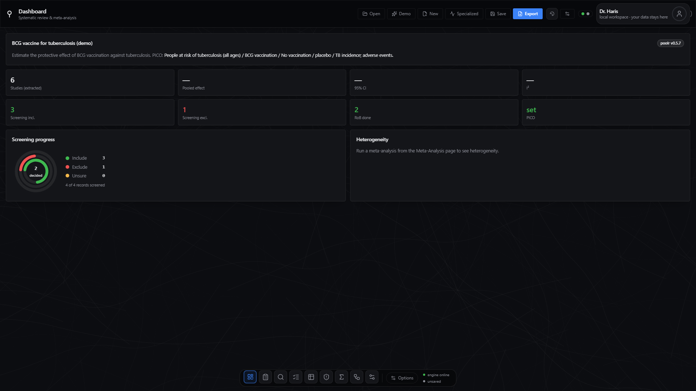
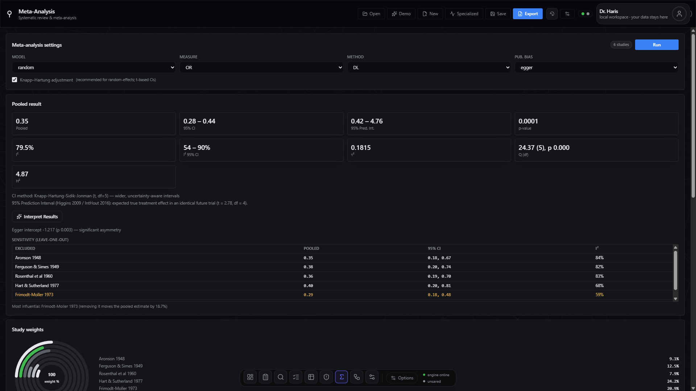
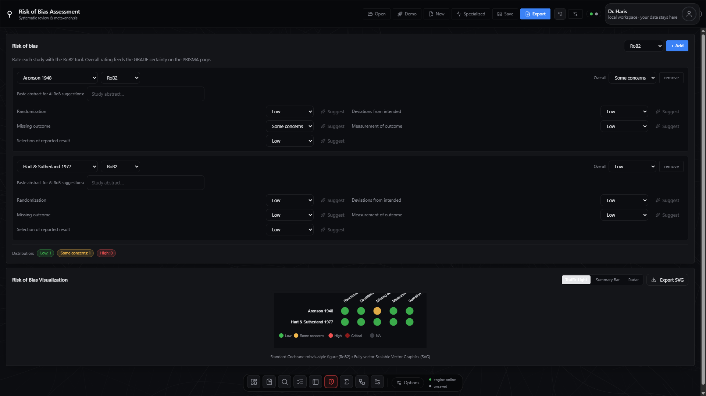
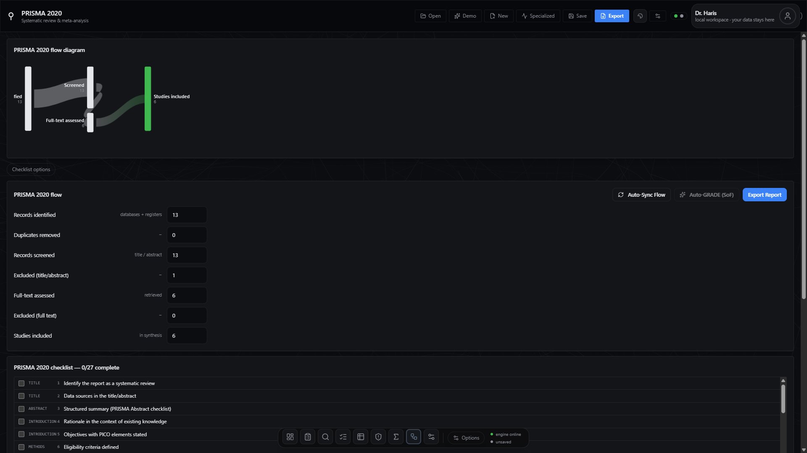
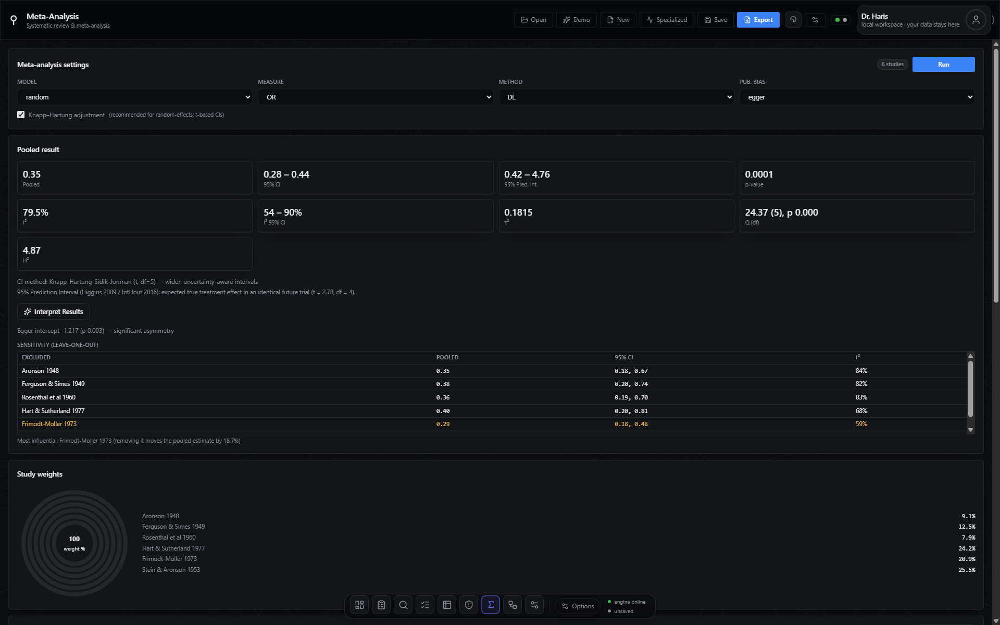
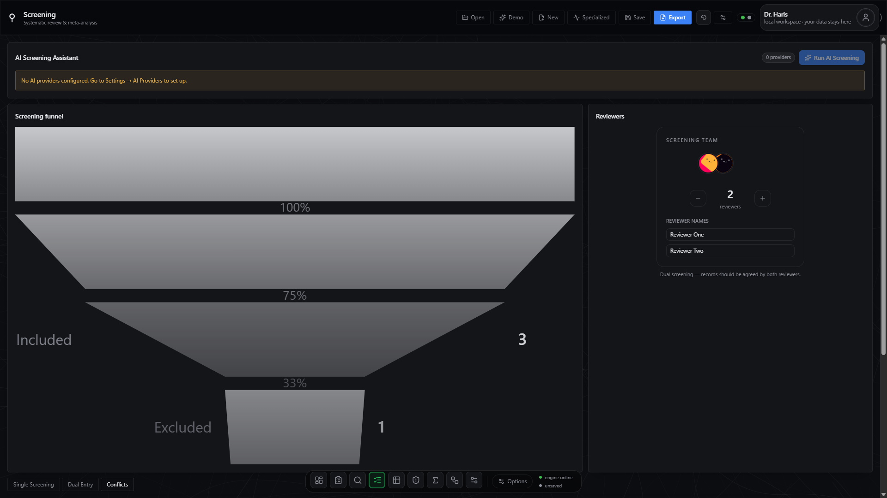
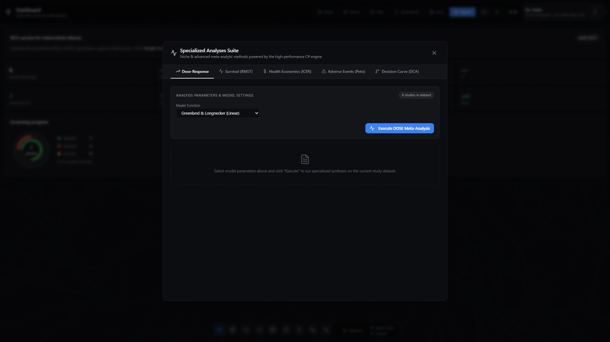
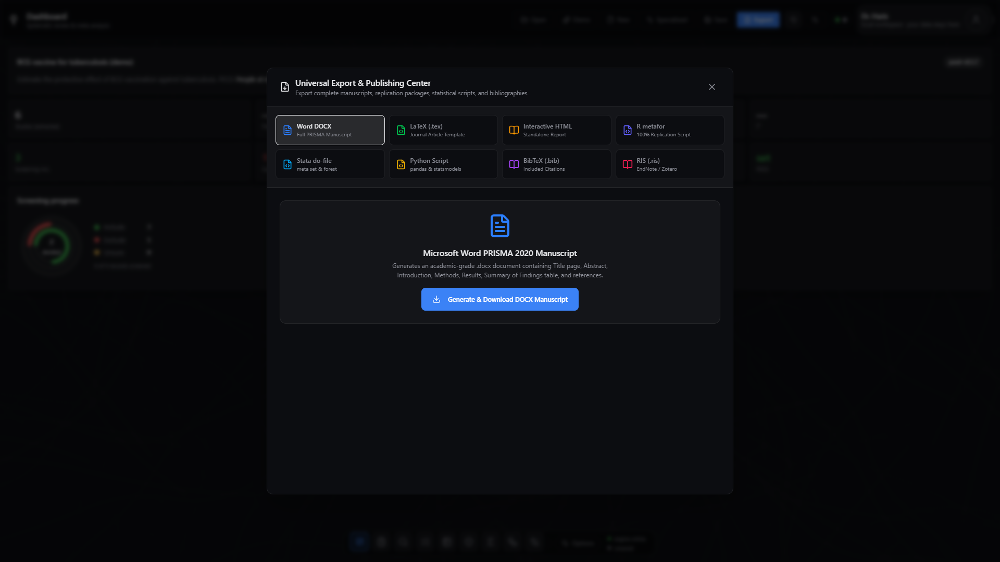

# poolr

<div align="center">

[](https://github.com/harisawan-bit/poolr/releases)
[](https://github.com/harisawan-bit/poolr/actions/workflows/ci.yml)
[](https://github.com/harisawan-bit/poolr/actions/workflows/build.yml)
[](https://www.prisma-statement.org/)
[](https://training.cochrane.org/handbook)
[](https://dotnet.microsoft.com/)
[](https://tauri.app/)
[](https://react.dev/)
[]()
[](https://opensource.org/licenses/MIT)

**Free, open-source, no-code desktop application for Systematic Reviews & Meta-Analyses (SRMA)**

*From PICO protocol definition to publication-ready PRISMA 2020 manuscripts, vector diagnostics, and reproducible statistical scripts.*

[Download Installers](#direct-downloads) • [Features](#features) • [Screenshots](#screenshots) • [Architecture](#architecture) • [How to Cite](#how-to-cite-poolr) • [Releases](RELEASES.md)

</div>

---

> **Current release — v0.5.7.** Complete PRISMA 2020 Platform & Diagnostics Suite. Built for clinicians, epidemiologists, biostatisticians, and students. Features zero-warning .NET 8 / C# 12 statistical engine with gold-standard parity tests, vector Cochrane *robvis* Traffic Light & Summary Bar plots, Interactive Figure Studio (Contour-Enhanced Funnel, Galbraith, L'Abbé, Baujat), Higgins 95% Prediction Intervals, Trial Sequential Analysis (TSA), Model Averaging across 6 $\tau^2$ estimators, Specialized Analyses Hub (Dose-Response, Survival RMST, Health Economics, Adverse Events, DCA), Dual Screening with Cohen's Kappa $\kappa$, PRISMA 2020 auto-synced Sankey flow, and 1-click manuscript export to Word (.docx), LaTeX (.tex), Standalone HTML, R metafor (.R), Stata (.do), Python (.py), BibTeX, and RIS. 100% offline-first, native desktop build, and 100% Python-free.

---

## Table of Contents

1. [Screenshots & Visual Tour](#screenshots)
2. [Direct Downloads (v0.5.7)](#direct-downloads)
3. [Key Features by SRMA Phase](#features)
4. [Interactive Figure Studio & Visualizations](#interactive-figure-studio)
5. [Specialized Analyses Suite](#specialized-analyses-suite)
6. [Universal Manuscript & Script Export Center](#universal-export-center)
7. [How Poolr Compares](#how-poolr-compares)
8. [Architecture & Technology Stack](#architecture)
9. [How to Cite Poolr](#how-to-cite-poolr)
10. [Local Development & Testing](#local-development)
11. [Community & Contributing](#contributing)

---

## Screenshots

| **Dashboard** — Screening Rings, Heterogeneity Gauge & PICO Overview | **Meta-Analysis** — Forest Plot, Pooled Diamond & 95% Prediction Interval |
|:---:|:---:|
|  |  |

| **Cochrane robvis** — Vector Traffic Light & Summary Bar Plots | **PRISMA 2020** — Interactive Sankey Flow & 27-Item Checklist Tracker |
|:---:|:---:|
|  |  |

| **Interactive Figure Studio** — Contour-Enhanced Funnel Plot | **Dual Screening** — Cohen's $\kappa$ Agreement & Conflict Dashboard |
|:---:|:---:|
|  |  |

| **Specialized Analyses Hub** — Dose-Response, Survival RMST & DCA | **Universal Export Center** — Word, LaTeX, HTML, R, Stata, Python |
|:---:|:---:|
|  |  |

---

## Direct Downloads

Poolr runs natively on Windows, macOS, and Linux without requiring Python, R, Docker, or runtime configuration.

| Operating System | Architecture | Installer Package | Direct Download (v0.5.7) |
|---|---|---|---|
| **Windows** | x64 (Standard Intel/AMD) | `.msi` (Enterprise) / `.exe` (NSIS) | [poolr_0.5.7_x64_en-US.msi](https://github.com/harisawan-bit/poolr/releases/download/v0.5.7/poolr_0.5.7_x64_en-US.msi) · [poolr_0.5.7_x64-setup.exe](https://github.com/harisawan-bit/poolr/releases/download/v0.5.7/poolr_0.5.7_x64-setup.exe) |
| **Windows** | ARM64 (Surface / Copilot+ PC) | `.msi` / `.exe` | [poolr_0.5.7_arm64_en-US.msi](https://github.com/harisawan-bit/poolr/releases/download/v0.5.7/poolr_0.5.7_arm64_en-US.msi) · [poolr_0.5.7_arm64-setup.exe](https://github.com/harisawan-bit/poolr/releases/download/v0.5.7/poolr_0.5.7_arm64-setup.exe) |
| **Windows** | x86 (32-bit Legacy) | `.msi` / `.exe` | [poolr_0.5.7_x86_en-US.msi](https://github.com/harisawan-bit/poolr/releases/download/v0.5.7/poolr_0.5.7_x86_en-US.msi) · [poolr_0.5.7_x86-setup.exe](https://github.com/harisawan-bit/poolr/releases/download/v0.5.7/poolr_0.5.7_x86-setup.exe) |
| **macOS** | Apple Silicon (M1/M2/M3/M4) | `.dmg` | [poolr_0.5.7_aarch64.dmg](https://github.com/harisawan-bit/poolr/releases/download/v0.5.7/poolr_0.5.7_aarch64.dmg) |
| **macOS** | Intel x64 | `.dmg` | [poolr_0.5.7_x64.dmg](https://github.com/harisawan-bit/poolr/releases/download/v0.5.7/poolr_0.5.7_x64.dmg) |
| **Linux** | x86_64 (Debian / Ubuntu / Mint) | `.deb` | [poolr_0.5.7_amd64.deb](https://github.com/harisawan-bit/poolr/releases/download/v0.5.7/poolr_0.5.7_amd64.deb) |
| **Linux** | x86_64 (Fedora / RHEL / openSUSE)| `.rpm` | [poolr-0.5.7-1.x86_64.rpm](https://github.com/harisawan-bit/poolr/releases/download/v0.5.7/poolr-0.5.7-1.x86_64.rpm) |

---

## Features

### 1. Protocol & PICO Formulation
- Structured input for **Population**, **Intervention**, **Comparator**, and **Outcomes**.
- Protocol tracking: PROSPERO registration ID, publication date boundaries, inclusion criteria, and language restrictions.
- All state auto-persisted to standard, human-readable `poolr.json` files.

### 2. Multi-Database Search Builder
- Automated search query generator converting PICO parameters into optimized boolean expressions for:
  - **PubMed / MEDLINE** (with MeSH expansion)
  - **Embase**
  - **Cochrane CENTRAL**
  - **Scopus**
  - **Web of Science**
- Real-time API retrieval from **NCBI Entrez E-utilities**, **OpenAlex**, **Crossref**, and **ClinicalTrials.gov**.
- 1-click copy and export of documented search strategies for manuscript methodology appendices.

### 3. Dual Screening & Inter-Rater Reliability
- Independent **Title & Abstract** and **Full-Text** screening stages.
- Multi-reviewer configuration (1 to 4 independent reviewers).
- **Conflict Resolution UI**: Automated $2 \times 2$ contingency table calculating:
  - Observed percent agreement ($P_o$)
  - **Cohen's Kappa ($\kappa$)** and Standard Error
  - $95\%$ Confidence Intervals
  - **Landis & Koch qualitative strength classification** (Slight, Fair, Moderate, Substantial, Almost Perfect)
  - 1-click **Copy Methods Statement** button for copy-pasting into manuscript methodology.
- **Promote Included (N)**: 1-click progression of title/abstract includes directly to full-text screening.
- **Priority Screening**: Machine-learning ranking of unreviewed citations against PICO criteria.

### 4. Structured Data Extraction
- Multi-type study extraction: Binary, Continuous (Mean $\pm$ SD, Sample size), Time-to-Event (HR, Log[HR], SE), Proportions, and Diagnostic Accuracy.
- **Import from Screening**: 1-click populator creating study records directly from screened inclusions.
- Flexible CSV/TSV table importer with automated column header detection and mapping.
- Automatic missing summary completion: Wan et al. (2014) median and IQR to mean and SD converter.

### 5. Risk of Bias Assessment (Cochrane robvis)
- Domain-level assessments for standard evidence synthesis tools:
  - **RoB 2** (Randomized Controlled Trials)
  - **ROBINS-I** (Non-Randomized Studies of Interventions)
  - **QUADAS-2** (Diagnostic Accuracy Studies)
  - **AMSTAR-2** (Systematic Review Quality)
  - **Newcastle-Ottawa Scale (NOS)** (Cohort / Case-Control Studies)
- Publication-grade vector graphics complying with McGuinness & Higgins (2021) *robvis*:
  - **Traffic Light Plots**: Domain-by-study colored circle matrices.
  - **Weighted Summary Bar Plots**: Proportion of studies / sample weights at Low, Some Concerns, High, or Critical risk of bias.
  - 1-click Scalable Vector Graphics (`.svg`) vector download.

### 6. Classical & Advanced Meta-Analysis Engine
- **Effect Measures**: Odds Ratio (OR), Risk Ratio (RR), Risk Difference (RD), Mean Difference (MD), Standardized Mean Difference (SMD / Hedges' $g$), Hazard Ratio (HR), Single-Arm Proportions (Freeman-Tukey double arcsine), Correlation ($z$), and Generic Inverse-Variance.
- **Statistical Pooling Models**: Fixed-Effect (Inverse Variance, Mantel-Haenszel, Peto) and Random-Effects.
- **Between-Study Variance ($\tau^2$) Estimators**:
  - DerSimonian-Laird (DL)
  - Restricted Maximum Likelihood (REML)
  - Paule-Mandel (PM)
  - Empirical Bayes (EB)
  - Hunter-Schmidt (HS)
  - Sidik-Jonkman (SJ)
- **Small-Sample Adjustment**: Knapp-Hartung-Sidik-Jonkman (KHSJ) $t$-distribution adjustments.
- **Heterogeneity Evaluation**: Cochran's $Q$, $I^2$ (with Jackson 95% CI), $\tau^2$, $H^2$.
- **Higgins 95% Prediction Interval**: $PI = \hat{\theta} \pm t_{k-2} \sqrt{SE^2 + \tau^2}$ predicting the treatment effect in a future clinical trial.
- **Sensitivity Analyses**: Leave-one-out influence analysis ranking, cumulative meta-analysis, and fixed vs. random discordance diagnostics.
- **Publication Bias & Small-Study Diagnostics**: Egger's regression test, Begg's rank test, Duval & Tweedie trim-and-fill, PET/PEESE meta-regression, $p$-curve analysis, and 3-parameter selection models (3PSM).

---

## Interactive Figure Studio

Poolr features an integrated vector graphics studio that renders publication-ready charts in real time with 1-click SVG download:

1. **Forest Plots**: Proportional study weight markers, individual confidence intervals, pooled diamond summary, reference lines ($1.0$ for ratios, $0.0$ for differences), and study weight percentages.
2. **Standard Funnel Plots**: Pseudo-95% confidence intervals centered on the pooled estimate.
3. **Contour-Enhanced Funnel Plots**: Overlays $p < 0.10, p < 0.05, p < 0.01$ statistical significance zones (Peters et al. 2008) to assist in differentiating publication bias from other causes of funnel plot asymmetry.
4. **Galbraith Radial Plots**: Standardized effect size $z$-scores plotted against precision ($1/SE$) for instant graphical outlier identification outside the $\pm 2$ error corridor.
5. **L'Abbé Plots**: Plots experimental event rates vs. control event rates to inspect treatment homogeneity across study baselines.
6. **Baujat Heterogeneity Diagnostics**: Compares each study's contribution to overall Cochran's $Q$ against its influence on the pooled effect size.

---

## Specialized Analyses Suite

Accessible from the top header or via Command Palette (`Ctrl+K`):

- **Dose-Response Meta-Analysis**: Greenland & Longnecker linear trend estimation and 3-knot restricted cubic spline / Emax modeling (`/api/dose`).
- **Survival RMST Meta-Analysis**: Restricted Mean Survival Time differences pooled up to truncation horizon $\tau$ (`/api/survival`).
- **Health Economics Evaluation**: Bivariate cost-effectiveness pooling, Incremental Cost-Effectiveness Ratio (ICER), and Incremental Net Monetary Benefit (INMB) across willingness-to-pay thresholds $\lambda$ (`/api/specialized/economic`).
- **Adverse Events & Peto Odds Ratios**: Peto one-step pooling with zero-event continuity corrections and Number Needed to Harm (NNH) (`/api/specialized/adverse`).
- **Decision Curve Analysis (DCA)**: Net Benefit curves evaluated across clinical decision threshold probabilities $p_t$ (`/api/advanced/dca`).
- **Trial Sequential Analysis (TSA)**: Calculates Required Information Size (RIS) based on $\alpha=0.05, \beta=0.20$ and tracks cumulative $Z$-curve crossing against Lan-DeMets O'Brien-Fleming monitoring boundaries.
- **Multimodel Inference (Model Averaging)**: Computes AICc-weighted pooled estimates across 6 $\tau^2$ estimators to eliminate single-estimator selection bias.

---

## Universal Export Center

Generate complete manuscript files and replication packages with one click (`Ctrl+E`):

| Format | Output Type | Description |
|---|---|---|
| **Word (`.docx`)** | PRISMA 2020 Manuscript | Formatted Word document containing Title, Structured Abstract, PICO, Search Strategy, Screening Flow, Extraction Table, Meta-Analysis summary, and GRADE SoF table. |
| **LaTeX (`.tex`)** | Academic Article | Publication-grade LaTeX template with `booktabs`, `amsmath`, and PGF/TikZ figure wrappers. |
| **HTML (`.html`)** | Standalone Interactive Report | Self-contained HTML report with embedded CSS, interactive vector charts, and offline tables. |
| **R Script (`.R`)** | `metafor` Replication Code | Executable R script recreating the exact analysis, forest plot, and funnel plot using `metafor::rma()`. |
| **Stata (`.do`)** | Stata Meta Script | Executable Stata do-file using official `meta esize` and `meta forestplot` syntax. |
| **Python (`.py`)** | `statsmodels` Replication Code | Python script using `pandas` and `statsmodels` for reproducible independent recalculation. |
| **BibTeX (`.bib`)** | Citation Bibliography | Formatted BibTeX bibliography of all included studies. |
| **RIS (`.ris`)** | Reference Manager Archive | Standard RIS file compatible with EndNote, Zotero, Mendeley, and Rayyan. |

---

## How Poolr Compares

| Feature | **Poolr** | Cochrane RevMan | R (`metafor`) | JASP | Covidence / Rayyan |
|---|:---:|:---:|:---:|:---:|:---:|
| **Price** | **100% Free & Open-Source** | Free (Web only) / Subscription | Free & Open-Source | Free & Open-Source | Commercial / Freemium |
| **Installation** | **Standalone Native Desktop** | Web browser | CLI / IDE required | Native Desktop | Web browser |
| **No-Code Interface** | :white_check_mark: | :white_check_mark: | :x: | :white_check_mark: | :white_check_mark: |
| **Data Privacy (100% Local)** | :white_check_mark: | :x: (Cloud-stored) | :white_check_mark: | :white_check_mark: | :x: (Cloud-stored) |
| **Full PRISMA 2020 Pipeline** | :white_check_mark: (All 8 stages) | Partial (No search/screening) | :x: (Analysis only) | :x: (Analysis only) | Screening only |
| **Dual Screening + Cohen's $\kappa$** | :white_check_mark: | :x: | :x: | :x: | :white_check_mark: |
| **Cochrane robvis Vector Figures** | :white_check_mark: | :x: (Separate tool) | Via `robvis` package | :x: | :x: |
| **Figure Studio (Contour/Galbraith/Baujat)**| :white_check_mark: | :x: | Via scripts | Partial | :x: |
| **Trial Sequential Analysis (TSA)** | :white_check_mark: | :x: | Via `tsa` package | :x: | :x: |
| **Dose-Response / Survival RMST / DCA** | :white_check_mark: | :x: | Via complex scripts | :x: | :x: |
| **1-Click Word / LaTeX Manuscript Export** | :white_check_mark: | :x: | :x: | :x: | :x: |
| **1-Click R & Stata Replication Script** | :white_check_mark: | :x: | Self | :x: | :x: |
| **Python Dependency Free** | :white_check_mark: (100% Python-free) | :white_check_mark: | :white_check_mark: | :white_check_mark: | :white_check_mark: |

---

## Architecture

Poolr is designed as a modular, multi-tier native desktop application with decoupled UI and statistical computation layers:

```
┌────────────────────────────────────────────────────────────────────────┐
│                        Tauri 2 Native Desktop Shell                    │
│                 (Rust / Windows WebView2, WebKitGTK, WKWebView)        │
└────────────────────────────────────┬───────────────────────────────────┘
                                     │
                 ┌───────────────────┴───────────────────┐
                 │                                       │
                 ▼                                       ▼
┌─────────────────────────────────┐   HTTP REST   ┌──────────────────────────────┐
│       Frontend User Interface   │ ────────────> │     C# 12 / .NET 8 Engine    │
│  React 19 · TypeScript · Vite   │ <──────────── │  ASP.NET Core (127.0.0.1:5180│
│  Tailwind CSS · Bklit UI Charts │ (JSON/Vector) │  Math.NET · SkiaSharp SVG    │
└─────────────────────────────────┘               └──────────────────────────────┘
                 │                                               │
                 ▼                                               ▼
     ┌────────────────────────┐                    ┌────────────────────────────┐
     │  Local File Storage    │                    │ Process Lifecycle Sentinel │
     │  Project poolr.json    │                    │ Win32 JobObject / POSIX    │
     │  Autosave & LocalStore │                    │ Auto-reaping on App Close  │
     └────────────────────────┘                    └────────────────────────────┘
```

For in-depth technical documentation regarding inter-process communication, zero-zombie process guarantees, and statistical precision validation, read [ARCHITECTURE.md](ARCHITECTURE.md).

---

## How to Cite Poolr

If you use Poolr to conduct, screen, analyze, or report evidence in your systematic review or meta-analysis, please cite the software:

### APA Format
> Awan, M. H. (2026). *Poolr: Free, open-source desktop platform for systematic reviews & meta-analyses* (Version 0.5.7) [Computer software]. https://github.com/harisawan-bit/poolr

### BibTeX
```bibtex
@software{Awan_Poolr_2026,
  author = {Awan, Muhammad Haris},
  title = {{Poolr: Free, Open-Source Desktop Platform for Systematic Reviews & Meta-Analyses}},
  version = {0.5.7},
  year = {2026},
  url = {https://github.com/harisawan-bit/poolr},
  publisher = {GitHub}
}
```

Standardized machine-readable citation metadata is maintained in [CITATION.cff](CITATION.cff).

---

## Local Development

### Prerequisites
- **Node.js**: >= 20.x (v24 LTS recommended)
- **.NET SDK**: 8.0.x
- **Rust**: 1.77+ with Cargo
- **Git**

### Step-by-Step Setup
```bash
# Clone repository
git clone https://github.com/harisawan-bit/poolr.git
cd poolr

# 1. Install frontend dependencies and run dev server
cd frontend
npm install
npm run dev

# 2. In a separate terminal, launch the .NET 8 statistics engine (port 5180)
cd engine
dotnet run --project Poolr.Engine.Api/Poolr.Engine.Api.csproj

# 3. Or launch the full native desktop environment (Tauri 2 + bundled engine)
cd src-tauri
cargo tauri dev
```

### Running the Test & Verification Matrix
```bash
# 1. C# 12 Engine mathematical parity suite (xUnit)
dotnet test engine/Poolr.Engine.Tests/Poolr.Engine.Tests.csproj -c Release

# 2. C# Engine code formatting check (enforced in CI)
dotnet format engine/Poolr.Engine.Api/Poolr.Engine.Api.csproj --verify-no-changes

# 3. Frontend linting, type-checking, and unit tests
cd frontend
npm run lint
npm run build
npm test -- --run

# 4. Rust desktop shell formatting and clippy
cd src-tauri
cargo fmt --check
cargo clippy --all-targets -- -D warnings
```

---

## Contributing

We warmly welcome contributions from the medical research, biostatistics, and open-source software communities. Please review:
- [CONTRIBUTING.md](CONTRIBUTING.md) — Contribution guidelines, conventional commit rules, and PR workflow.
- [CODE_OF_CONDUCT.md](CODE_OF_CONDUCT.md) — Contributor Covenant v2.1.
- [ROADMAP.md](ROADMAP.md) — Upcoming feature milestones and version plans.
- [SECURITY.md](SECURITY.md) — Vulnerability disclosure policy.
- [SUPPORT.md](SUPPORT.md) — Support channels and triage matrix.

---

## License

This project is licensed under the **MIT License** — see the [LICENSE](LICENSE) file for details. Free for academic, non-commercial, and commercial research.

© 2026 Muhammad Haris Awan.
